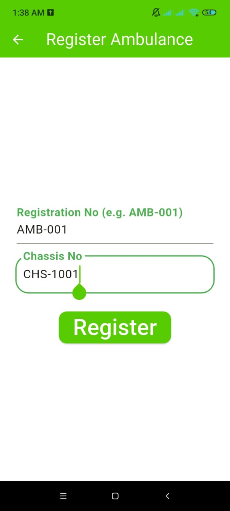
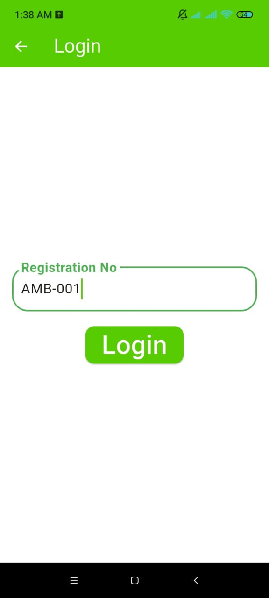
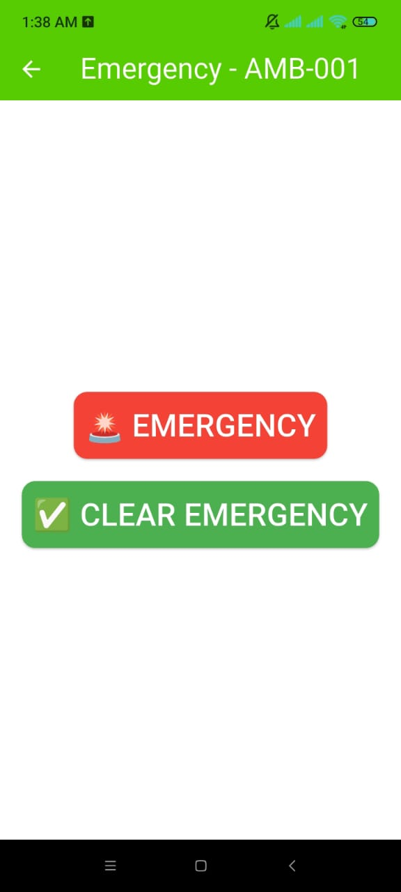

# AmbuGo
Smart traffic light system for **Ambulances**  using ESP32 +Firebase 

**AmbuGo** is a smart traffic light management system that gives ambulances priority at intersections.  
When an ambulance driver presses the Emergency Button in the app, the system:
Sends live ambulance data to Firebase.
Automatically turns the ambulance’s lane GREEN and all others RED.
Restores normal cycle once the emergency clears.
---

## ✨ Features
- 📡 **Real-time database (Firebase)** – Stores ambulance status (`active` / `clear`) and location.  
- 🚦 **Smart ESP32 Traffic Lights** – ESP32 reads Firebase and controls LEDs at intersections.  
- 📱 **Flutter Mobile App** – Ambulance driver can register, login, and press an emergency button.    
- 🔄 **Automatic Return to Normal Cycle** – Once emergency is clear, traffic lights resume normal operation.  
  
## 🛠️ Tech Stack
- **Hardware**: ESP32, LEDs, Resistors, Breadboard
- **Software**:  
  - Flutter (Mobile App)  
  - Firebase Realtime Database (Backend)  
  - ESP32 (PlatformIO firmware)  
---

## 📂 Real-time database (Firebase) Structure
---
 {
  "ambulances": {
    "AMB-001": { "chassis_no": "CHS-1001", "verified": false }
  },
  "emergencies": {
    "_README": "App writes here per ambulance. Keyed by reg_no, e.g., AMB-001."
  },
  "intersections": {
    "_README": "ESP32 nodes can store their fixed lat/lng + state here if you wish."
  },
  "trafficControl": {
    "mode": "NORMAL"
  }
}
 ## 📸 Project Screenshots

### 🚦 Traffic Light Setup

### 📱 AmbuGo Splash Screen

### 📱 AmbuGo Registration screen

### 📱 AmbuGo Login screen

### 📱 AmbuGo Emergency screen

## 🚀 How It Works
1. Ambulance driver registers once with **Registration Number+ Chassis Number** of ambulance in AmbuGo app.
2. Verified drivers log in using **Registraion number only**.
3. On pressing **Emergency** status is updated in **Firebase**:  
   {
     "emergencies": {
       "AMB-001": {
         "status": "active",
         "lat": ....,
         "lng": ....
       }
     }
   }
1. ESP32 reads Firebase if status = active, the ambulance lane turns GREEN and all others turn RED.
2. When ambulance passes (status = clear), system returns to normal cycle.
---

📂 **Project Structure**

AmbuGo/
│── esp32_traffic                # ESP32 code (PlatformIO)
│── ambugo                      # Flutter mobile app code
|__images/                      # Screenshots & demo media
│── README.md                   # Project documentation

---

🚀 **Setup Guide**

ESP32

1. Clone repo & open esp32_traffic folder in PlatformIO/Arduino IDE.
2. Update WiFi credentials & Firebase database URL in code.
3. Upload to ESP32 board.

Flutter App

1. Open ambugo folder in Android Studio / VS Code.
2. Update Firebase config (google-services.json).
3. Run on Android device.

---

🌍 **Future Improvements**

📡 GSM/Lora support for offline emergency handling.
🚦 Smart coordination between multiple intersections.

---

👩‍💻 Author
Developed by **Rafia Maqsood** 💡
University of Home Economics, Lahore – Dept. of Computer Science & IT

